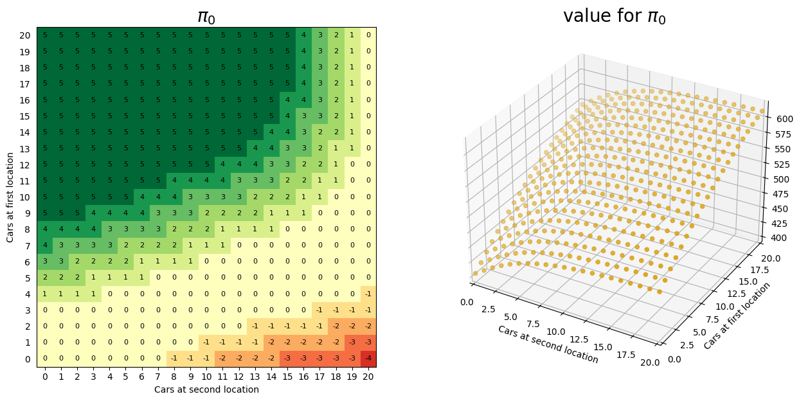
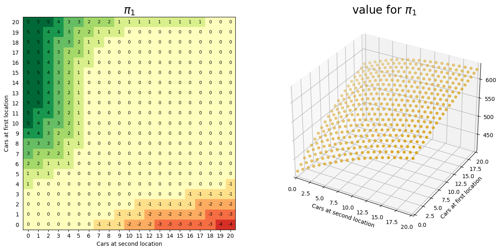
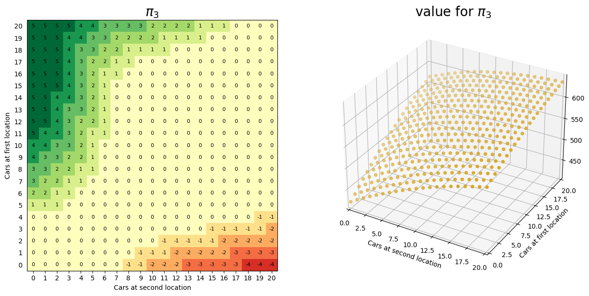

# Jacks-Car-Rental
### Description
- I use policy iteration and value iteration respectively to solve Jack's Car Rental.
- Please run `main.py` to execute this program.
- You can modify code in main.py `mode = test1` to test Policy Iteration or `mode = test2` to test Value Iteration.
- Two folders **policy** and **value** store images of the experimental results, generated by `draw_fig()`.
- It's worth noticing that, in this example, value iteration exhibits a slower pace compared to policy iteration, but I don't know how to explain it.

### Results

#### 1. Policy iteration results

#### 2. Value iteration results

#### 3. Summary

In the case of **policy iteration**, it is evident that policy evaluation durations decrease as the policy converges. An intriguing observation is the relatively slower pace of value iteration compared to policy iteration in this scenario. The reason lies in the necessity for value iteration to examine all feasible actions from each state during every iteration.

In the context of **value iteration**, one can notice a gradual reduction in the maximum change in state values as the algorithm approaches convergence. It's worth highlighting that, in contrast to policy iteration, value iteration tends to exhibit a slower execution in this specific example. This can be attributed to the fact that value iteration requires evaluating all potential actions for every state in each iteration, resulting in a longer runtime compared to policy iteration.

Both **policy iteration** and **value iteration** ultimately yield the same result. The optimal solution, as derived from the methodology outlined in the figure, involves redistributing vehicles based on the initial number of vehicles at each location. However, it's worth noting that intuitively, the maximum revenue occurs when the number of vehicles at both locations is at its maximum (20), allowing for the highest number of cars available for rent.
